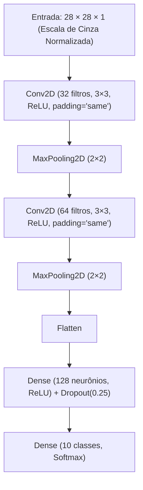

# 🧠 Reconhecedor de Dígitos MNIST no Navegador (TensorFlow.js)

<p align="center">
  
  
  
  
</p>

Aplicação web interativa para reconhecimento de dígitos manuscritos (**0 a 9**) em tempo real. O modelo de **Rede Neural Convolucional (CNN)** é treinado em Python, exportado para formato web e executado **100% no navegador do usuário via TensorFlow.js**, sem necessidade de backend, API ou conexão com a internet após o carregamento da página.

---

## ✨ Principais Funcionalidades

* ✍️ **Quadro de Desenho Interativo**: Canvas responsivo de alta precisão com suporte completo a mouse, trackpad e telas de toque (*touchscreen* em celulares e tablets).
* 🎯 **Auto-Centralização por Bounding Box (Padrão MNIST)**: Algoritmo de pré-processamento que recorta a caixa delimitadora do traço desenhado e o redimensiona/centraliza em uma área 20×20 dentro da grade 28×28, garantindo alta acurácia mesmo para desenhos pequenos ou fora do centro.
* ⚡ **Inferência em Tempo Real com Zero Latência**: Classificação contínua a cada traço (< 5 ms de tempo de inferência via WebGL/Wasm).
* 📊 **Distribuição das 10 Probabilidades**: Gráfico com barras animadas exibindo a porcentagem de certeza do modelo para cada dígito de 0 a 9.
* 🔍 **Diagnóstico de Confusão (Top-2)**: Análise inteligente que compara a probabilidade do 1º colocado com o 2º colocado mais próximo para identificar casos de ambiguidade (ex: 4 vs 9, 3 vs 8, 7 vs 1).
* 🎛️ **Barra de Ferramentas Completa**: Alternância entre **Caneta** (*Pen*), **Borracha** (*Eraser*), seletor de espessuras (*Fino*, *Médio*, *Grosso*) e **Desfazer** (*Undo*) com histórico de até 25 estados.
* 🔢 **Chips de Teste Rápido (0 a 9)**: Botões para preenchimento instantâneo de dígitos sintéticos para testes rápidos do modelo.
* ⌨️ **Atalhos Globais de Teclado**: Suporte a comandos rápidos no desktop.

---

## ⌨️ Atalhos de Teclado

| Tecla / Atalho | Ação |
| :--- | :--- |
| <kbd>Ctrl</kbd> + <kbd>Z</kbd> ou <kbd>Cmd</kbd> + <kbd>Z</kbd> | **Desfazer** o último traço |
| <kbd>C</kbd> ou <kbd>Delete</kbd> / <kbd>Backspace</kbd> | **Limpar** todo o quadro |
| <kbd>P</kbd> ou <kbd>B</kbd> | Selecionar a **Caneta** (*Pen / Brush*) |
| <kbd>E</kbd> | Selecionar a **Borracha** (*Eraser*) |
| <kbd>0</kbd> a <kbd>9</kbd> | Desenhar instantaneamente o exemplo do número |

---

## 🧠 Arquitetura da Rede Neural (CNN)

A rede convolucional foi projetada para equilibrar **alta acurácia (>99%)** com **baixo tamanho de download (~1.2 MB)** para execução instantânea no navegador:



### Detalhes do Treinamento:
* **Dataset**: MNIST Completo (60.000 imagens de treino / 10.000 de teste).
* **Função de Perda**: `sparse_categorical_crossentropy`
* **Otimizador**: `Adam(learning_rate=0.001)`
* **Callbacks**: `EarlyStopping(monitor='val_loss', patience=3, restore_best_weights=True)`
* **Acurácia de Teste**: ~99.2%

---

## 📁 Estrutura do Projeto

O código-fonte segue a separação limpa de responsabilidades:

```text
digits-28/
├── 📄 index.html            # Estrutura semântica da aplicação web
├── 🎨 style.css             # Folha de estilos, fontes e gradientes
├── ⚡ app.js                # Lógica do Canvas, Bounding Box e TFJS
├── 🐍 treinar_mnist.py      # Pipeline completo de treino, avaliação e matriz de confusão
├── 🔧 converter_standalone.py # Conversor de modelo Keras 3 para formato TensorFlow.js
├── 📁 modelo_web/           # Modelo exportado pronto para o browser
│   ├── 📄 model.json        # Topologia e arquitetura das camadas
│   └── 📦 group1-shard1of1.bin # Pesos binários da rede
├── 📄 .gitignore            # Arquivos ignorados pelo Git
└── 📄 README.md             # Documentação do projeto
```

---

## 🚀 Como Executar Localmente

### Pré-requisitos
* Python 3.9+ ou Node.js instalado (apenas para servir os arquivos estáticos localmente).

### 1. Iniciar o Servidor Local
Como navegadores modernos bloqueiam o carregamento de arquivos `.json` e `.bin` via protocolo local direto (`file://`) por segurança (CORS), execute um servidor HTTP simples na pasta do projeto:

```bash
# Opção A: Com Python (já nativo no sistema)
python -m http.server 8000

# Opção B: Com Node.js / npx
npx serve .
```

### 2. Acessar a Aplicação
Abra o navegador e acesse:
👉 **`http://localhost:8000`**

---

## 🏋️‍♂️ Como Treinar o Modelo Novamente (Opcional)

Se desejar alterar a arquitetura da rede neural ou treinar com novos hiperparâmetros:

1. Instale as dependências Python:
   ```bash
   pip install tensorflow numpy matplotlib seaborn
   ```
2. Execute o script de treinamento:
   ```bash
   python treinar_mnist.py
   ```
3. O script gerará os gráficos da curva de aprendizado, a **Matriz de Confusão 10×10** e exportará automaticamente os arquivos para a pasta `modelo_web/`.

---

## 🛠️ Tecnologias Utilizadas

* **[TensorFlow.js](https://www.tensorflow.org/js)** — Execução de inferência de Deep Learning no navegador.
* **[HTML5 Canvas API](https://developer.mozilla.org/pt-BR/docs/Web/API/Canvas_API)** — Renderização de traços táteis e pré-processamento de imagem.
* **[Tailwind CSS](https://tailwindcss.com/)** — Estilização moderna e layout responsivo.
* **[Lucide Icons](https://lucide.dev/)** — Ícones nítidos e consistentes para interface.
* **[Keras & TensorFlow (Python)](https://www.tensorflow.org/)** — Treinamento da CNN e avaliação estatística.
